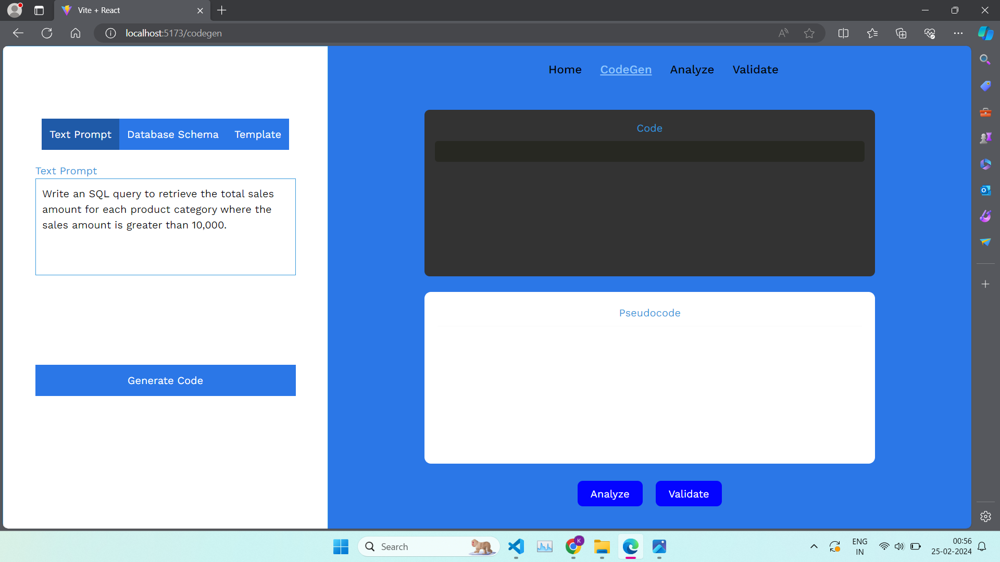
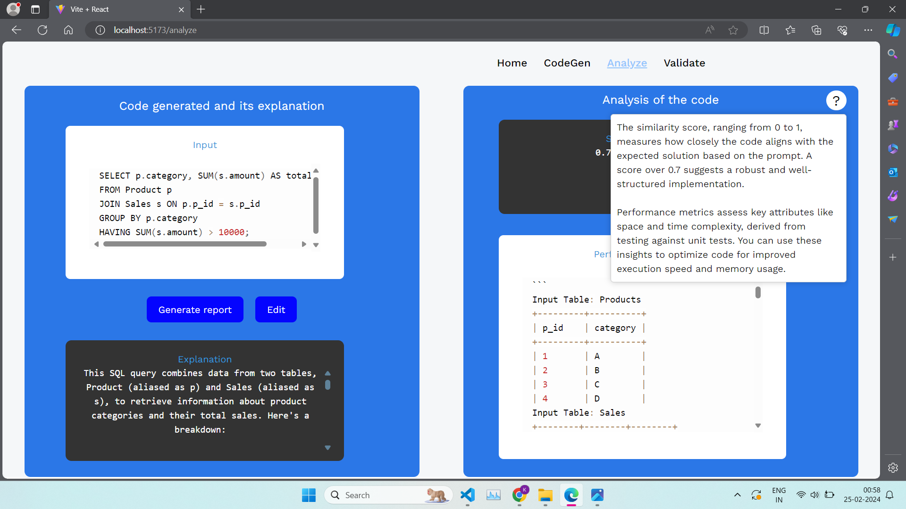

# CodeKraft: Automatic Code Generator


## Table of Contents

- [Project](#CodeKraft)
  - [Table of Contents](#table-of-contents)
  - [About The Project](#about-the-project)
  - [Demo](#demo)
  - [File Structure](#file-structure)
  - [Getting started](#Getting-Started)
  - [Screenshots of Website](#screenshots-of-website)
  - [Contributors](#contributors)
  - [License](#license)

## About The Project

This project aims to create a user-friendly tool for generating code quickly based on simple text prompts. Users can input their requirements using natural language, along with structured data like JSON objects and database schemas. The tool then generates code in real-time, tests it for reliability and efficiency, and provides a clean interface for easy interaction. Leveraging large language models, it translates prompts into intermediate steps and final code, focusing on simplicity and accuracy throughout the process. Additionally, it includes features for generating pseudocode and reports containing performance metrics to ensure efficient code generation.

## Demo


https://github.com/Khushi-Balia/CodeKraft/assets/104241344/da9e4824-3899-40a1-bfe8-8473ec930dae


## File Structure
```
👨‍💻CodeKraft
 ┣ 📂assets                            // Contains all the reference gifs, images
 ┣ 📂client                            // Frontend        
 ┃ ┃ ┣ 📂src                                      
 ┃ ┃ ┃ ┣ 📂components  
 ┃ ┃ ┃ ┃ ┣ 📄HomeInfo.jsx  
 ┃ ┃ ┃ ┃ ┣ 📄Loader.jsx
 ┃ ┃ ┃ ┃ ┣ 📄Navbar.jsx
 ┃ ┃ ┃ ┣ 📂model                       // For 3D Rendering  
 ┃ ┃ ┃ ┃ ┣ 📄Bird.jsx 
 ┃ ┃ ┃ ┃ ┣ 📄Island.jsx
 ┃ ┃ ┃ ┃ ┣ 📄Sky.jsx
 ┃ ┃ ┃ ┣ 📂pages  
 ┃ ┃ ┃ ┃ ┣ 📄Analyze.jsx
 ┃ ┃ ┃ ┃ ┣ 📄Codegen.jsx
 ┃ ┃ ┃ ┃ ┣ 📄DataContext.jsx
 ┃ ┃ ┃ ┃ ┣ 📄Home.jsx
 ┃ ┃ ┃ ┃ ┣ 📄Validate.jsx
 ┃ ┃ ┃ ┃ ┣ 📄index.js
 ┃ ┃ ┃ ┣ 📄App.jsx
 ┃ ┃ ┃ ┣ 📄index.css
 ┃ ┃ ┃ ┣ 📄main.css
 ┃ ┃ ┣ 📄index.html
 ┣ 📂model                             // Standalone model         
 ┃ ┣ 📄model.py   
 ┣ 📂server                            // Backend 
 ┃ ┣ 📄app.py   
 ┃ ┣ 📄requirements.txt
 ┣ 📄README.md
```
## Getting Started

### Installation

Clone the project by typing the following command in your Terminal/CommandPrompt

```
git clone https://github.com/Khushi-Balia/CodeKraft
```
Navigate to the CodeKraft folder

```
cd CodeKraft
```

### Usage

Once the project is installed, follow the steps below to run the project:

#### Frontend

Open a new terminal in root folder and navigate to the client folder

```
cd client
```

Install all the required dependencies

```
npm i
```

To run the frontend

```
npm run dev
```

Once the above command is executed, the frontend will be running at ```localhost:5173```. You can visit http://localhost:5173/ to view the website.

#### Backend

To generate a API Key, refer the steps as given <a href = "https://www.kdnuggets.com/how-to-access-and-use-gemini-api-for-free">here</a>. Create a new file in ```/model``` directory called ```config.txt``` and paste the API key in it.

Open a new terminal in root folder and navigate to the server folder

```
cd server
```

Create a virtual environment to install all the dependencies

```
python -m venv codekraft
```

Activate the virtual environment

For Windows: ```codekraft\Scripts\activate```

For Linux: ```source codekraft/bin/activate```

Install all the required dependencies

```
pip install -r requirements.txt
```

To run the backend

```
python app.py
```

## Screenshots of Website

Landing page of the website

Generating an SQL query






Generating a C++ code


## Contributors

* <a href="https://github.com/devayani03">Devayani Chandane</a>
* <a href="https://github.com/Khushi-Balia">Khushi Balia</a>
* <a href="https://github.com/PritK99">Prit Kanadiya</a>
* <a href="https://github.com/shark-21">Shardul Khade</a>

## License
[MIT License](https://opensource.org/licenses/MIT)
